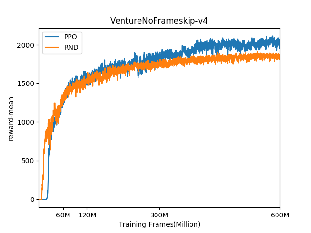
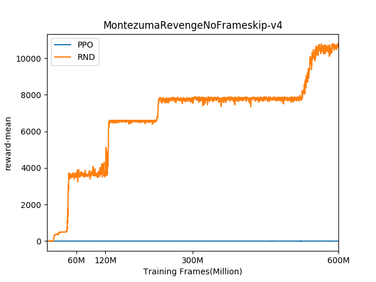
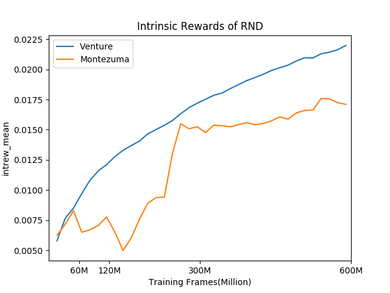

# Intrinsic-Rewards
A collection of deep reinforcement learning algorithms with intrinsic rewards,
based on [Rainy](https://github.com/kngwyu/Rainy) and [PyTorch](https://pytorch.org/).

## Setup
First, install [pipenv](https://pipenv.readthedocs.io/en/latest/).
E.g. you can install it via
``` bash
pip install pipenv --user
```

Then you can create a virtual environment for isolated installing of related packages.
```bash
pipenv --site-packages --three install
```

## Run

### RND
With 32 parallel workers:
```bash
pipenv run experiments/rnd_atari.py --override='config.nworkers=32' train
```
With 64 parallel workers:
```bash
pipenv run experiments/rnd_atari.py train
```
With 128 parallel workers(needs [horovod](https://horovod.readthedocs.io/en/latest/)):
```bash
horovodrun -np 2 -H localhost:1,$other_host_name:1 pipenv run python experiments/rnd_atari.py train
```

## Implemented Algorithms

### Random Network Distillation
- https://arxiv.org/abs/1810.12894
- command: `pipenv run python experiments/rnd_atari.py`

## Results
Commit hash: aa4ebf0c3e9090d11fbd88a5de44aa2189f1d232

- RND
  - 128 parallel enviroments, No MPI + CNN policy(NO LSTM)
  - All parameters are the same as the paper
- PPO
  - with the same setting
  - All parameters are in [ppo_atari.py](experiments/ppo_atari.py)

### Score





### Intrinsic rewards


## License
This project is licensed under Apache License, Version 2.0
([LICENSE-APACHE](LICENSE) or http://www.apache.org/licenses/LICENSE-2.0).
